# 🧠 Deep Research AI - Advanced Multi-Agent Research System

<div align="center">


**An advanced AI-powered research system combining multi-agent architecture with cutting-edge reasoning techniques**

[Features](#-features) • [Architecture](#-system-architecture) • [Installation](#-installation) • [Usage](#-usage) • [Deployment](#-deployment) • [Screenshots](#-screenshots)


</div>

---

## 📖 Table of Contents

- [Overview](#-overview)
- [Features](#-features)
- [System Architecture](#-system-architecture)
- [Technology Stack](#-technology-stack)
- [Installation](#-installation)
- [Configuration](#-configuration)
- [Usage](#-usage)
- [API Documentation](#-api-documentation)
- [Screenshots](#-screenshots)
- [Deployment](#-deployment)
- [Project Structure](#-project-structure)
- [Contributing](#-contributing)
- [License](#-license)


---

## 🌟 Overview

**Deep Research AI** is a sophisticated research automation system that leverages advanced AI reasoning techniques to conduct comprehensive, multi-dimensional research on any topic. Built with a multi-agent architecture, it performs parallel web searches, cross-validates sources, and generates detailed, citation-rich reports.

### Why Deep Research AI?

- 🤖 **Multi-Agent Architecture**: Deploys 3+ specialized agents working in parallel
- 🧠 **Advanced Reasoning**: Implements Chain of Thought, Self-Consistency, and Tree of Thoughts
- ⭐ **Source Verification**: Cross-validates information across multiple sources
- 📊 **Comprehensive Reports**: Generates executive summaries with full citations
- 🎨 **Beautiful UI**: Modern, responsive interface with real-time progress tracking
- 🚀 **Production Ready**: Fully functional and deployable system

---

## ✨ Features

### Core Capabilities

- **🔍 Intelligent Query Decomposition**
  - Chain of Thought reasoning for query analysis
  - Automatic breakdown into research dimensions
  - Strategic search query generation

- **🤖 Multi-Agent Parallel Execution**
  - 3 specialized agents per research task
  - Asynchronous parallel web searches
  - Real-time progress tracking

- **✅ Self-Consistency Validation**
  - Cross-validation of sources
  - Confidence scoring based on repeated mentions
  - Deduplication and aggregation

- **📝 Advanced Report Generation**
  - AI-powered executive summaries
  - Detailed sectional analysis
  - Proper citation formatting
  - Export to Markdown and JSON

- **⭐ Source Verification**
  - High-confidence source identification
  - Cross-reference tracking
  - Verification badges

### Technical Features

- FastAPI backend with async support
- React-based responsive frontend
- RESTful API architecture
- Real-time progress updates
- Comprehensive error handling
- Configurable research depth (3-10 tasks)

---
## 🏗️ System Architecture

### Workflow Diagram

```mermaid
%%{init: {
  "theme": "base",
  "themeVariables": {
    "primaryColor": "#ffffff",
    "primaryTextColor": "#1f2937",
    "lineColor": "#9ca3af",
    "edgeLabelBackground":"#ffffff",
    "fontSize": "14px",
    "fontFamily": "Inter, sans-serif",
    "tertiaryColor": "#f3f4f6"
  }
}}%%

graph TB
    Start(["🔍 User Research Query"]) --> Step1

    %% STEP 1
    subgraph Step1["Step 1 ▸ Query Analysis & Planning"]
        A["🧩 User Query Input"] --> B["🧠 Chain of Thought<br/>Decomposition"]
        B --> C["🔎 Query Analysis"]
        C --> D["🗂️ Generate Research Dimensions"]
        D --> E["🌳 Create Sub-Queries (Tree of Thoughts)"]
    end

    Step1 --> Step2

    %% STEP 2
    subgraph Step2["Step 2 ▸ Multi-Agent Execution"]
        E --> F1["🤖 Agent 1<br/>Market Analysis"]
        E --> F2["🤖 Agent 2<br/>Competition Research"]
        E --> F3["🤖 Agent 3<br/>Technical Analysis"]
        
        F1 --> G1["🌐 Web Search 1"]
        F1 --> G2["🌐 Web Search 2"]
        F1 --> G3["🌐 Web Search 3"]
        
        F2 --> H1["🌐 Web Search 1"]
        F2 --> H2["🌐 Web Search 2"]
        F2 --> H3["🌐 Web Search 3"]
        
        F3 --> I1["🌐 Web Search 1"]
        F3 --> I2["🌐 Web Search 2"]
        F3 --> I3["🌐 Web Search 3"]
        
        G1 --> J1["📄 Aggregated Results (Agent 1)"]
        H1 --> J2["📄 Aggregated Results (Agent 2)"]
        I1 --> J3["📄 Aggregated Results (Agent 3)"]
    end

    Step2 --> Step3

    %% STEP 3
    subgraph Step3["Step 3 ▸ Synthesis & Validation"]
        J1 --> K["📊 Aggregate All Results"]
        J2 --> K
        J3 --> K
        K --> L["🧩 Self-Consistency Validation"]
        L --> M["🧹 Deduplicate Sources"]
        M --> N["📈 Confidence Scoring"]
        N --> O["🔁 Cross-Validation"]
        O --> P["💡 Extract Key Insights"]
        P --> Q["🧠 LLM Synthesis (Sequential Revision)"]
        Q --> R["🗒️ Generate Executive Summary"]
        R --> S["📚 Create Detailed Sections"]
    end

    Step3 --> Step4

    %% STEP 4
    subgraph Step4["Step 4 ▸ Final Output"]
        S --> T["🧾 Format Citations"]
        T --> U["✅ Verification Report"]
        U --> V["📘 Complete Research Report"]
        V --> W1["⬇️ Download Markdown"]
        V --> W2["⬇️ Download JSON"]
        V --> W3["🌐 View in Browser"]
    end

    W3 --> End(["🎯 User Receives Results"])

    %% STYLE DEFINITIONS
    style Start fill:#e0f2fe,stroke:#0284c7,stroke-width:2px,color:#0c4a6e
    style End fill:#dcfce7,stroke:#16a34a,stroke-width:2px,color:#064e3b

    style Step1 fill:#e0f2fe,stroke:#0284c7,stroke-width:2px,color:#0c4a6e
    style Step2 fill:#ede9fe,stroke:#7c3aed,stroke-width:2px,color:#312e81
    style Step3 fill:#f0fdf4,stroke:#22c55e,stroke-width:2px,color:#064e3b
    style Step4 fill:#fff7ed,stroke:#f97316,stroke-width:2px,color:#7c2d12

```



### Advanced Reasoning Techniques

The system implements multiple state-of-the-art AI reasoning approaches:

1. **Chain of Thought (CoT)** - Step-by-step problem decomposition
2. **Tree of Thoughts (ToT)** - Exploration of multiple reasoning paths
3. **Self-Consistency** - Multiple sampling with majority voting
4. **Sequential Revision** - Iterative refinement of outputs
5. **Search & Verify** - Solution space exploration with verification

---

## 🛠️ Technology Stack

### Backend
- **Framework**: FastAPI 0.104+
- **Language**: Python 3.8+
- **Async**: asyncio, aiohttp
- **API Integration**: 
  - OpenRouter API (LLM)
  - SerpAPI (Web Search)

### Frontend
- **Library**: React 18
- **Styling**: Tailwind CSS + Custom CSS
- **Build**: Babel (in-browser compilation)
- **HTTP**: Fetch API

### APIs & Services
- **OpenRouter**: GPT-4o-mini, Claude 3.5 Sonnet, Llama 3.1
- **SerpAPI**: Google search results

---

## 📦 Installation

### Prerequisites

- Python 3.8 or higher
- pip (Python package manager)
- OpenRouter API key ([Get here](https://openrouter.ai/))
- SerpAPI key ([Get here](https://serpapi.com/))

### Backend Setup

```bash
# Clone the repository
git clone https://github.com/AdiityaRaj/deep-research-ai.git
cd deep-research-ai

# Create virtual environment
python -m venv venv

# Activate virtual environment
# On Windows:
venv\Scripts\activate
# On macOS/Linux:
source venv/bin/activate

# Install dependencies
cd backend
pip install -r requirements.txt

# Create .env file
cp .env.example .env
# Edit .env and add your API keys
```

### Frontend Setup

```bash
# Navigate to frontend directory
cd ../frontend

# No build required! Just open index.html
# Or use a local server:
python -m http.server 8080
           or
python -m http.server 8080 --bind 127.0.0.1 
```

---

## ⚙️ Configuration

### Environment Variables

Create a `.env` file in the `backend/` directory:

```env
# OpenRouter Configuration
OPENROUTER_API_KEY=sk-or-v1-your-key-here
MODEL_NAME=openai/gpt-4o-mini

# SerpAPI Configuration
SERPAPI_KEY=your-serpapi-key-here

# Optional: Advanced Settings
MAX_PARALLEL_AGENTS=3
SEARCHES_PER_AGENT=3
CONFIDENCE_THRESHOLD=2
```

### Frontend Configuration

Edit `frontend/js/utils.js` to configure API endpoint:

```javascript
const API_CONFIG = {
    baseUrl: 'http://localhost:8000'  // Change for production
};
```

---

## 🚀 Usage

### Starting the Application

**1. Start Backend:**
```bash
cd backend
uvicorn main:app --reload
```
Backend runs at: `http://localhost:8000`

**2. Start Frontend:**
```bash
cd frontend
python -m http.server 8080
```
Frontend runs at: `http://localhost:8080`

### Running Research

**Via Web Interface:**
1. Open `http://localhost:8080` in browser
2. Enter research query or select an example
3. Adjust research depth (3-10 tasks)
4. Click "Start Research"
5. Wait 30-90 seconds for results
6. Download report (Markdown or JSON)

**Via API:**
```bash
curl -X POST http://localhost:8000/run \
  -H "Content-Type: application/json" \
  -d '{
    "query": "Analyze AI agent trends in 2024",
    "max_tasks": 5
  }'
```

### Example Queries

Try these sample queries:
- "Analyze the competitive landscape of AI agents in 2024"
- "Latest developments in quantum computing"
- "Electric vehicle market trends 2024"
- "Impact of generative AI on software development"
- "Future of renewable energy technologies"

---

## 📚 API Documentation

### Endpoints

#### `GET /`
Health check endpoint
```json
{
  "status": "operational",
  "version": "4.0",
  "features": [...]
}
```

#### `GET /health`
Detailed system status
```json
{
  "status": "healthy",
  "openrouter_configured": true,
  "serpapi_configured": true,
  "model": "openai/gpt-4o-mini"
}
```

#### `POST /run`
Execute deep research

**Request:**
```json
{
  "query": "Your research question",
  "max_tasks": 5
}
```

**Response:**
```json
{
  "query": "...",
  "planning": {
    "dimensions": [...],
    "total_searches": 9
  },
  "executive_summary": "...",
  "sections": [...],
  "all_sources": [...],
  "verification": [...],
  "metadata": {
    "total_sources": 42,
    "high_confidence_sources": 5,
    "techniques_used": [...]
  }
}
```

### Interactive API Docs

Once backend is running, visit:
- Swagger UI: `http://localhost:8000/docs`
- ReDoc: `http://localhost:8000/redoc`

---

## 📸 Screenshots

### Main Interface
*Beautiful landing page with example queries and animated gradient background*


### Research in Progress
*Real-time progress tracking with stage updates and animated progress bar*


### Results Dashboard
*Comprehensive results with metrics, agent strategy, and sections*


### Executive Summary
*AI-generated comprehensive summary of research findings*


### Detailed Sections
*Expandable sections with key findings and source citations*


### Source Verification
*Sources with confidence scores and verification badges*


### Research Strategy
*Multi-agent deployment showing parallel research dimensions*


### Full web Page  
*Multi-agent deployment showing full web page of deep research ai*


---

## 🌐 Deployment

### Backend Deployment

**Railway (Recommended):**
```bash
cd backend
railway login
railway init
railway up
```

**Render:**
1. Connect GitHub repository
2. Select `backend/` as root directory
3. Build command: `pip install -r requirements.txt`
4. Start command: `uvicorn main:app --host 0.0.0.0`

**Fly.io:**
```bash
cd backend
fly launch
fly deploy
```

### Frontend Deployment

**Vercel (Recommended):**
```bash
cd frontend
vercel
```

**Netlify:**
1. Drag and drop `frontend/` folder to Netlify
2. Or connect GitHub repository

**GitHub Pages:**
```bash
cd frontend
git subtree push --prefix frontend origin gh-pages
```

### Environment Variables for Production

Update `.env` in backend and `js/utils.js` in frontend with production URLs.

---

## 📁 Project Structure

```
Deep-Research-AI/
├── backend/
│   ├── main.py                    # FastAPI application
│   ├── research_agent.py          # Main orchestrator
│   ├── query_decomposer.py        # Chain of Thought
│   ├── multi_agent_executor.py    # Multi-agent execution
│   ├── synthesizer.py             # Self-Consistency & synthesis
│   ├── citation_manager.py        # Citation formatting
│   ├── config.py                  # Configuration
│   ├── requirements.txt           # Python dependencies
│   └── .env                       # Environment variables
│
├── frontend/
│   ├── index.html                 # Main HTML
│   ├── css/
│   │   └── styles.css            # Custom styles
│   ├── js/
│   │   ├── utils.js              # Utilities
│   │   ├── components.js         # React components
│   │   └── app.js                # Main app
│   └── assets/                    # Images/icons
│
├── docs/
│   ├── shscreenots/              # UI screenshots
│   └── architecture.md           # Architecture docs
│
├── .gitignore
├── LICENSE
└── README.md                      # This file
```

---

## 🧪 Testing

### Backend Tests
```bash
cd backend
python test_system.py
```

Expected output:
```
✅ Health check passed
✅ Configuration check passed
✅ Research completed in 85.44s
✅ ALL TESTS PASSED!
```

### Manual Testing Checklist
- [ ] Backend starts without errors
- [ ] Frontend loads with animations
- [ ] Can submit research query
- [ ] Progress bar animates
- [ ] Results display correctly
- [ ] Sources show confidence scores
- [ ] Download functionality works
- [ ] Mobile responsive

---

## 🔧 Troubleshooting

### Common Issues

**Backend won't start:**
- Check Python version (3.8+)
- Verify all dependencies installed
- Check `.env` file exists with valid API keys

**Frontend shows blank page:**
- Check browser console for errors
- Verify all 5 files created correctly
- Check backend is running

**API connection failed:**
- Verify backend URL in `js/utils.js`
- Check CORS is enabled in backend
- Ensure backend is running on correct port

**Search results empty:**
- Verify SerpAPI key is valid
- Check API quota/limits
- Try different query

---

## 🤝 Contributing

Contributions are welcome! Please follow these steps:

1. Fork the repository
2. Create feature branch (`git checkout -b feature/amazing-feature`)
3. Commit changes (`git commit -m 'Add amazing feature'`)
4. Push to branch (`git push origin feature/amazing-feature`)
5. Open Pull Request

### Development Guidelines

- Follow PEP 8 for Python code
- Use meaningful variable names
- Add comments for complex logic
- Test before submitting PR
- Update documentation as needed

---

## 📊 Performance

- **Query Processing**: 30-90 seconds average
- **Parallel Searches**: 9 searches per query (3 agents × 3 searches)
- **Source Analysis**: 40+ sources per research
- **API Calls**: ~12 total (9 SerpAPI + 3 OpenRouter)

### Optimization Tips

- Reduce `max_tasks` for faster results
- Use caching for repeated queries
- Adjust `CONFIDENCE_THRESHOLD` for stricter validation
- Configure `MAX_PARALLEL_AGENTS` based on API limits

---

## 📄 License

This project is licensed under the MIT License - see the [LICENSE](LICENSE) file for details.

---

## 🙏 Acknowledgments

- **OpenRouter** - LLM API access
- **SerpAPI** - Web search functionality
- **FastAPI** - Backend framework
- **React** - Frontend library
- **Tailwind CSS** - Styling framework

---

## 📞 Support

- **Issues**: [GitHub Issues](https://github.com/AdiityaRaj/deep-research-ai/issues)
- **Discussions**: [GitHub Discussions](https://github.com/AdiityaRaj/deep-research-ai/discussions)
- **Email**: rajaditya2424@gmail.com

---

## 🗺️ Roadmap

### Version 1.1 (Upcoming)
- [ ] WebSocket support for real-time updates
- [ ] User authentication and query history
- [ ] Custom agent configuration
- [ ] PDF export functionality
- [ ] Batch research processing

### Version 2.0 (Future)
- [ ] Local LLM support (Ollama)
- [ ] Advanced visualization charts
- [ ] Collaborative research features
- [ ] Mobile app (React Native)
- [ ] Plugin system for extensibility

---

## ⭐ Star History

If you find this project useful, please consider giving it a star!

[](https://star-history.com/#AdiityaRaj/deep-research-ai&Date)

---

<div align="center">

**Built with ❤️ by Aditya Raj**

[⬆ Back to Top](#-deep-research-ai---advanced-multi-agent-research-system)

</div>
